# RunBot - AI Assistant for Event Management

An intelligent messaging assistant that automates event coordination and communication via SMS. RunBot manages contact lists, coordinates with event organizers, sends reminders to attendees, and integrates with calendar and event management systems.

## Overview

RunBot automates the workflow of coordinating events by:
1. Reading calendar documents to identify upcoming events
2. Extracting organizer assignments from calendar entries
3. Matching events to Action Network to retrieve attendee lists
4. Optionally identifying nudge candidates based on attendance history
5. Sending personalized group SMS messages to attendees with their assigned organizers
6. Tracking message history to prevent duplicate notifications

The system runs on a schedule (typically hourly) and intelligently determines which events need reminders based on timing windows and previous message history.

## Workflow Diagram

```mermaid
flowchart TD
    Start([Cron Trigger]) --> TimeCheck{Within operating<br/>hours?}
    TimeCheck -->|No| End([Exit])
    TimeCheck -->|Yes| LoadCalendar[Load Calendar Document<br/>from Google Docs]

    LoadCalendar --> ParseEvents[LLM: Parse Events<br/>Extract names, times, organizers]

    ParseEvents --> FilterEvents{Events within<br/>time window?}
    FilterEvents -->|No events| End
    FilterEvents -->|Yes| MatchAction[Match Events to<br/>Action Network]

    MatchAction --> GetAttendees[Retrieve Attendee Lists<br/>with Phone Numbers]

    GetAttendees --> CheckNudges{Include nudges<br/>flag enabled?}
    CheckNudges -->|Yes| LoadAttendance[Load Attendance Data<br/>from Google Sheets]
    CheckNudges -->|No| ValidateContacts

    LoadAttendance --> AnalyzeNudges[Analyze Attendance History<br/>Identify Nudge Candidates]

    AnalyzeNudges --> ValidateContacts[Validate Contacts<br/>against Phone Directory]

    ValidateContacts --> LoopEvents{For each event}

    LoopEvents --> LoopAttendees{For each attendee}

    LoopAttendees --> FetchHistory[Fetch Message History<br/>for Attendee]

    FetchHistory --> CheckDupe{LLM: Already<br/>messaged about<br/>this event?}

    CheckDupe -->|Yes| NextAttendee[Skip to next attendee]
    CheckDupe -->|No| GetOrganizers[Get Assigned Organizers<br/>for this Event]

    GetOrganizers --> CreateGroup[Create/Find Group<br/>Conversation]

    CreateGroup --> SendMessage[Send Group SMS<br/>Attendee + Organizers<br/>+ Nudge Info if applicable]

    SendMessage --> NextAttendee
    NextAttendee --> LoopAttendees

    LoopAttendees -->|More attendees| LoopAttendees
    LoopAttendees -->|Done| LoopEvents

    LoopEvents -->|More events| LoopAttendees
    LoopEvents -->|Done| End

    style Start fill:#e1f5e1
    style End fill:#ffe1e1
    style SendMessage fill:#e1e5ff
    style CheckDupe fill:#fff9e1
    style ParseEvents fill:#f0e1ff
    style AnalyzeNudges fill:#ffe1f5
```



## How It Works

### Event Detection & Parsing

The main workflow starts in `scripts/main.py`, which orchestrates the entire messaging pipeline. The script uses an LLM to parse calendar documents stored in Google Docs, extracting:

- **Event names and times** - Identifies when events are happening
- **Organizer assignments** - Parses patterns like "BL: (H) John (T) Jane" to determine which organizers are responsible for each event
- **Date and location details** - Contextual information for messaging

The LLM-powered parsing allows for flexible calendar formats rather than requiring rigid structured data.

### Contact & Attendee Management

**Contact Directory Integration** (`utils/phone_utils.py`):
- Maintains a contact directory in a Google Doc with name-to-phone-number mappings
- Normalizes all phone numbers to E.164 format (+1XXXXXXXXXX) for consistency
- Handles various input formats: (555) 123-4567, 555-123-4567, +15551234567, etc.
- Validates organizers and attendees against the directory

**Action Network Integration** (`utils/action_network_utils.py`):
- Links calendar events to Action Network events by matching event names
- Retrieves RSVP lists and attendee information
- Provides structured attendee data including phone numbers and contact details

### Intelligent Messaging

**Message Deduplication**:
- Fetches message history on-demand from Twilio for specific attendees
- Uses LLM to analyze conversation content and determine if an event has already been mentioned
- Prevents duplicate notifications even across different group conversations
- Tracks both individual and group message contexts

**Group Conversation Management** (`tools/twilio.py`):
- Creates group MMS conversations with multiple recipients
- Each message includes the attendee plus their assigned organizers
- Reuses existing conversations when sending to the same group of people
- Formats messages with event details, time, location, and organizer contacts

**Time-Based Execution**:
- Operates only during configured hours (default: 8 AM - 8 PM)
- Processes events within a configurable time window (e.g., next 72 hours)
- Can simulate different times for testing purposes (`--simulate-time`)
- Supports dry-run mode for testing without sending actual messages (`--dry-run`)

### Nudge Candidates

**Attendance Analysis** (`utils/attendance_utils.py`):
- Optionally reads attendance data from Google Sheets to analyze past participation
- Identifies attendees who may benefit from extra encouragement (nudge candidates)
- When enabled with `--include-nudges`, incorporates nudge suggestions into messages
- Helps organizers prioritize outreach to attendees with lower attendance rates

The system reads from a configurable attendance column in Google Sheets to perform the analysis.

## Architecture

### Core Components

**Workflow Orchestrator**:
- `scripts/main.py` - Main entry point that coordinates all operations

**Utilities**:
- `utils/phone_utils.py` - Phone number normalization and validation
- `utils/action_network_utils.py` - Event and attendee integration
- `utils/attendance_utils.py` - Attendance analysis and nudge candidate identification

**External Integrations**:
- `tools/twilio.py` - SMS messaging with group conversation support
- `tools/google_docs.py` - Document reading and Google Sheets reading

### Key Design Principles

**LLM-Powered Flexibility**:
- Uses OpenAI's API to parse unstructured calendar documents
- Intelligently matches names to contacts, handling variations and nicknames
- Analyzes message history semantically rather than with rigid pattern matching

**Efficiency Optimizations**:
- On-demand message history fetching (only queries Twilio when needed for deduplication)
- Conversation reuse to minimize API calls
- Smart caching of contact directories and event data

**Reliability Features**:
- Phone number normalization ensures consistent formatting throughout
- Group conversation support with automatic fallback
- Dry-run mode for safe testing
- Comprehensive logging for debugging and monitoring

## Usage Examples

```bash
# Standard execution (sends messages for upcoming events)
python scripts/main.py

# Test without sending messages
python scripts/main.py --dry-run

# Simulate running at a different time
python scripts/main.py --simulate-time "2024-01-15,09:00"

# Include attendance-based suggestions
python scripts/main.py --include-nudges
```

### Automated Scheduling

The system is designed to run on a cron schedule:
```bash
0 * * * * cd /path/to/runbot && python scripts/main.py >> /var/log/runbot.log 2>&1
```

## Dependencies

**External Services**:
- OpenAI API for LLM-powered parsing and matching
- Twilio for SMS/MMS messaging
- Google Docs API for reading calendar documents
- Google Sheets API for reading attendance data
- Action Network API for event/attendee data (optional)

**Python Environment**:
- Managed with `uv` for fast, reliable dependency resolution
- Uses `python-dotenv` for environment configuration
- Built on `openai`, `twilio`, and `google-api-python-client` SDKs

## License

MIT
